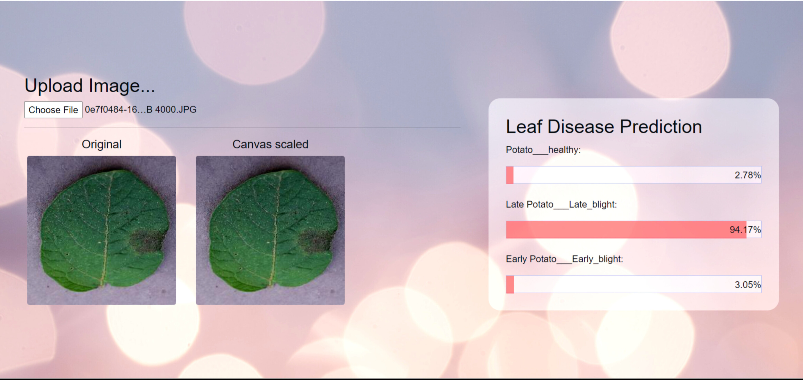

# Leaf-Disease-Prediction-On-Browser
Deploying neural networks on edge devices involves optimizing and deploying deep learning models on hardware that is located on the edge of a network, such as mobile devices, sensors, or small embedded systems.

## Model Training:
          python leaf_train.py  --epochs 5 --batch_size 16 --learning_rate 1e-4 --weight_decay 1e-5 --seed 1337 --path "D:\Dataset\potatoes\PlantVillage"
          
## Onnx Conversion:
          python to_convert_onnx.py --input_path "cnn_model_potato.pt" --onnx_file_path "potato_model.onnx"
          
## App Run

          npm run build && npx light-server -s . -p 8080
